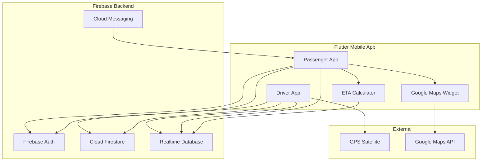

# Batta Tracker — System Architecture

## Overview

Batta Tracker is a cross-platform mobile application built with **Flutter** and **Firebase** that provides real-time GPS tracking of Batta Lorries on the Kalpitiya–Kandalkuliya route in Sri Lanka.

## Architecture Pattern

The app follows a **layered architecture** with **Provider** state management:

```
┌─────────────────────────────────────────────────────────┐
│                    Presentation Layer                    │
│  Screens • Widgets • Material Design 3 UI               │
├─────────────────────────────────────────────────────────┤
│                    State Management                      │
│  AuthProvider • TrackingProvider • ThemeProvider        │
├─────────────────────────────────────────────────────────┤
│                    Service Layer                         │
│  Auth • Location • LiveLocation • Trip • Vehicle • FCM  │
├─────────────────────────────────────────────────────────┤
│                    Data Layer                            │
│  Firebase Auth • Firestore • Realtime DB • Local Cache  │
├─────────────────────────────────────────────────────────┤
│                    External Services                     │
│  Google Maps SDK • GPS • Push Notifications             │
└─────────────────────────────────────────────────────────┘
```

## Component Diagram



## Data Flow

### Driver Location Sharing

1. Driver taps **Start Trip**
2. `LocationService` acquires GPS every 5 seconds
3. `LiveLocationService` writes to Realtime Database (`live_locations/{vehicleId}`)
4. Passengers subscribe to location stream
5. `EtaCalculator` computes arrival times per stop
6. `NotificationService` alerts when vehicle is ≤5 min away

### Passenger Tracking

1. Passenger selects their stop
2. App subscribes to all `live_locations`
3. Map displays vehicle markers + route polyline
4. ETA cards update in real-time
5. FCM/local notification fires at 5-minute threshold

## Technology Stack

| Layer | Technology |
|-------|-----------|
| Frontend | Flutter 3.x, Material Design 3 |
| State | Provider |
| Auth | Firebase Authentication |
| Structured Data | Cloud Firestore |
| Real-time GPS | Firebase Realtime Database |
| Push Notifications | Firebase Cloud Messaging |
| Maps | Google Maps Flutter SDK |
| Location | Geolocator |
| Offline Cache | SharedPreferences |
| i18n | flutter_localizations (EN, SI, TA) |

## Security

- Firebase Security Rules enforce role-based access
- Drivers can only update their own vehicle/trip data
- Live locations writable only by authenticated drivers
- Vehicle creation restricted to admin (Firebase Console)

## Scalability Considerations

- Realtime Database for high-frequency GPS updates (low latency)
- Firestore for structured queries (trips, users, ratings)
- FCM topic subscriptions per route (`route_kalpitiya_kandalkuliya`)
- Offline caching for routes and schedules

## Project Structure

```
lib/
├── main.dart                 # App entry + Firebase init
├── app.dart                  # MultiProvider setup
├── firebase_options.dart     # Firebase config
├── core/
│   ├── constants/            # App constants, route data
│   ├── theme/                # Material 3 themes
│   └── utils/                # Distance, ETA calculations
├── models/                   # Data models
├── services/                 # Firebase & device services
├── providers/                # State management
├── screens/
│   ├── auth/                 # Login, Register
│   ├── passenger/            # Passenger dashboards
│   ├── driver/               # Driver dashboard
│   └── shared/               # Settings
├── widgets/                  # Reusable UI components
└── l10n/                     # Localization ARB files
```
