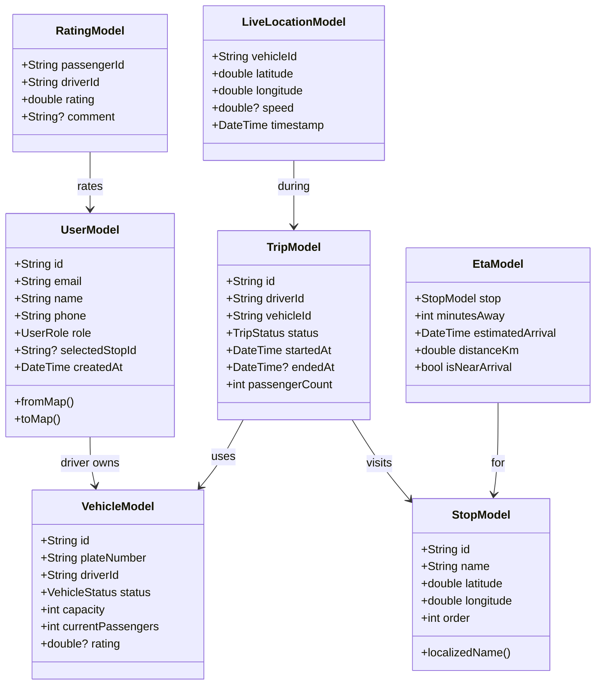
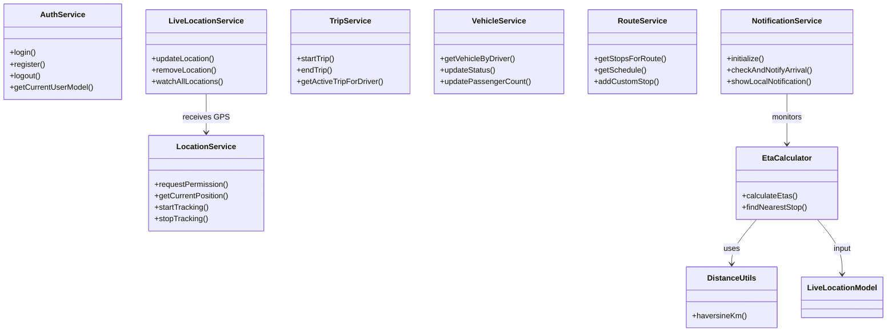
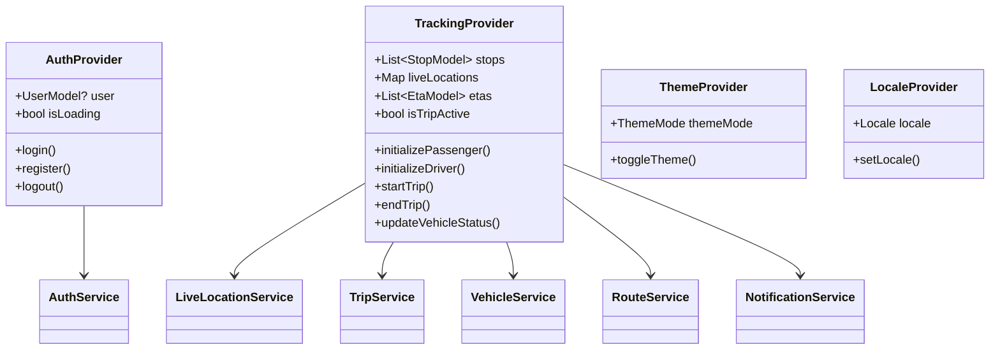
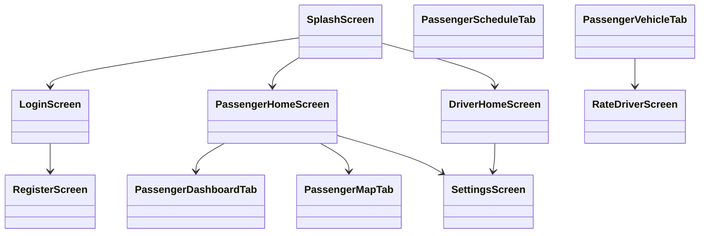

# Batta Tracker — Class Diagram

## Domain Models

```mermaid
classDiagram
    class UserModel {
        +String id
        +String email
        +String name
        +String phone
        +UserRole role
        +String? selectedStopId
        +DateTime createdAt
        +fromMap()
        +toMap()
    }

    class VehicleModel {
        +String id
        +String plateNumber
        +String driverId
        +VehicleStatus status
        +int capacity
        +int currentPassengers
        +double? rating
    }

    class TripModel {
        +String id
        +String driverId
        +String vehicleId
        +TripStatus status
        +DateTime startedAt
        +DateTime? endedAt
        +int passengerCount
    }

    class StopModel {
        +String id
        +String name
        +double latitude
        +double longitude
        +int order
        +localizedName()
    }

    class LiveLocationModel {
        +String vehicleId
        +double latitude
        +double longitude
        +double? speed
        +DateTime timestamp
    }

    class EtaModel {
        +StopModel stop
        +int minutesAway
        +DateTime estimatedArrival
        +double distanceKm
        +bool isNearArrival
    }

    class RatingModel {
        +String passengerId
        +String driverId
        +double rating
        +String? comment
    }

    UserModel --> VehicleModel : driver owns
    TripModel --> VehicleModel : uses
    TripModel --> StopModel : visits
    EtaModel --> StopModel : for
    LiveLocationModel --> TripModel : during
    RatingModel --> UserModel : rates
```

## Services

```mermaid
classDiagram
    class AuthService {
        +login()
        +register()
        +logout()
        +getCurrentUserModel()
    }

    class LocationService {
        +requestPermission()
        +getCurrentPosition()
        +startTracking()
        +stopTracking()
    }

    class LiveLocationService {
        +updateLocation()
        +removeLocation()
        +watchAllLocations()
    }

    class TripService {
        +startTrip()
        +endTrip()
        +getActiveTripForDriver()
    }

    class VehicleService {
        +getVehicleByDriver()
        +updateStatus()
        +updatePassengerCount()
    }

    class RouteService {
        +getStopsForRoute()
        +getSchedule()
        +addCustomStop()
    }

    class NotificationService {
        +initialize()
        +checkAndNotifyArrival()
        +showLocalNotification()
    }

    class EtaCalculator {
        +calculateEtas()
        +findNearestStop()
    }

    class DistanceUtils {
        +haversineKm()
    }

    LiveLocationService --> LocationService : receives GPS
    EtaCalculator --> DistanceUtils : uses
    EtaCalculator --> LiveLocationModel : input
    NotificationService --> EtaCalculator : monitors
```

## Providers (State Management)

```mermaid
classDiagram
    class AuthProvider {
        +UserModel? user
        +bool isLoading
        +login()
        +register()
        +logout()
    }

    class TrackingProvider {
        +List~StopModel~ stops
        +Map liveLocations
        +List~EtaModel~ etas
        +bool isTripActive
        +initializePassenger()
        +initializeDriver()
        +startTrip()
        +endTrip()
        +updateVehicleStatus()
    }

    class ThemeProvider {
        +ThemeMode themeMode
        +toggleTheme()
    }

    class LocaleProvider {
        +Locale locale
        +setLocale()
    }

    AuthProvider --> AuthService
    TrackingProvider --> LiveLocationService
    TrackingProvider --> TripService
    TrackingProvider --> VehicleService
    TrackingProvider --> RouteService
    TrackingProvider --> NotificationService
```

## Screens

```mermaid
classDiagram
    class SplashScreen
    class LoginScreen
    class RegisterScreen
    class PassengerHomeScreen
    class PassengerDashboardTab
    class PassengerMapTab
    class PassengerScheduleTab
    class PassengerVehicleTab
    class DriverHomeScreen
    class SettingsScreen
    class RateDriverScreen

    SplashScreen --> LoginScreen
    SplashScreen --> PassengerHomeScreen
    SplashScreen --> DriverHomeScreen
    LoginScreen --> RegisterScreen
    PassengerHomeScreen --> PassengerDashboardTab
    PassengerHomeScreen --> PassengerMapTab
    PassengerHomeScreen --> SettingsScreen
    PassengerVehicleTab --> RateDriverScreen
    DriverHomeScreen --> SettingsScreen
```
