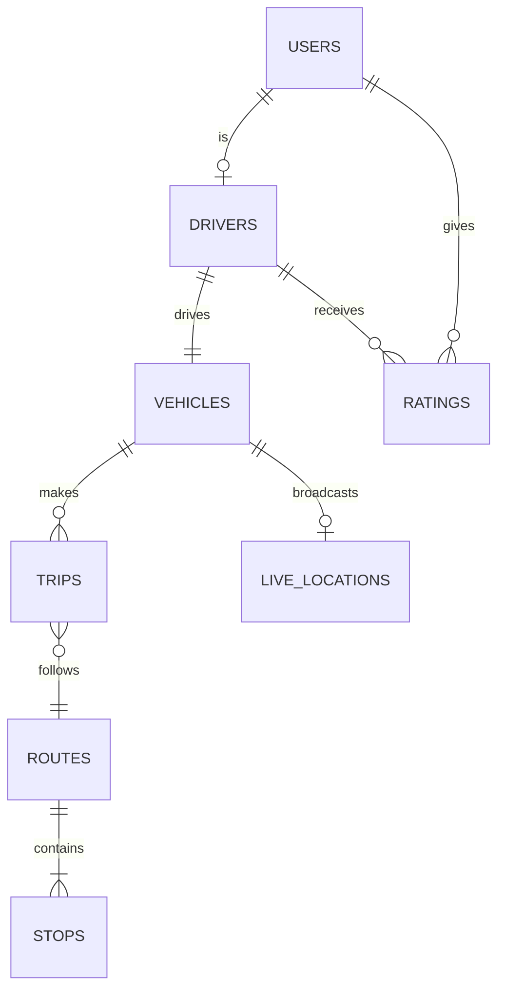

# Batta Tracker — Database Schema

## Cloud Firestore Collections

### `users`

| Field | Type | Description |
|-------|------|-------------|
| email | string | User email |
| name | string | Full name |
| phone | string | Phone number |
| role | string | `passenger` or `driver` |
| photoUrl | string? | Profile photo URL |
| selectedStopId | string? | Passenger's preferred stop |
| createdAt | timestamp | Registration date |
| updatedAt | timestamp? | Last update |

### `drivers`

| Field | Type | Description |
|-------|------|-------------|
| userId | string | Reference to users collection |
| name | string | Driver name |
| phone | string | Contact number |
| isActive | boolean | Active status |
| routeId | string | Assigned route ID |
| createdAt | timestamp | Registration date |

### `vehicles`

| Field | Type | Description |
|-------|------|-------------|
| plateNumber | string | License plate |
| driverId | string | Assigned driver UID |
| routeId | string | Route ID |
| status | string | `available`, `full`, `delayed`, `outOfService` |
| capacity | int | Max passengers (default: 20) |
| currentPassengers | int | Current count |
| model | string? | Vehicle model |
| color | string? | Vehicle color |
| rating | double? | Average driver rating |

### `routes/{routeId}`

| Field | Type | Description |
|-------|------|-------------|
| name | string | Route name (English) |
| nameSi | string | Sinhala name |
| nameTa | string | Tamil name |
| isActive | boolean | Route status |

#### Subcollection: `routes/{routeId}/stops/{stopId}`

| Field | Type | Description |
|-------|------|-------------|
| name | string | Stop name (English) |
| nameSi | string | Sinhala name |
| nameTa | string | Tamil name |
| latitude | double | GPS latitude |
| longitude | double | GPS longitude |
| order | int | Stop sequence |
| isCustom | boolean | Custom stop flag |

### `trips`

| Field | Type | Description |
|-------|------|-------------|
| driverId | string | Driver UID |
| vehicleId | string | Vehicle ID |
| routeId | string | Route ID |
| status | string | `active`, `completed`, `cancelled` |
| startedAt | timestamp | Trip start time |
| endedAt | timestamp? | Trip end time |
| passengerCount | int | Passengers on board |
| stopIds | array | List of stop IDs |

### `ratings`

| Field | Type | Description |
|-------|------|-------------|
| passengerId | string | Rater UID |
| driverId | string | Rated driver UID |
| tripId | string | Associated trip |
| rating | double | 1.0 – 5.0 |
| comment | string? | Optional feedback |
| createdAt | timestamp | Rating date |

### `schedules/{routeId}`

| Field | Type | Description |
|-------|------|-------------|
| departures | array | List of departure times (HH:mm) |

---

## Firebase Realtime Database

### `live_locations/{vehicleId}`

High-frequency GPS updates (every 5 seconds during active trips).

| Field | Type | Description |
|-------|------|-------------|
| tripId | string | Active trip ID |
| driverId | string | Driver UID |
| latitude | double | Current latitude |
| longitude | double | Current longitude |
| speed | double? | Speed in m/s |
| heading | double? | Direction in degrees |
| timestamp | string | ISO 8601 timestamp |

### `active_trips/{tripId}` (optional)

| Field | Type | Description |
|-------|------|-------------|
| vehicleId | string | Vehicle ID |
| driverId | string | Driver UID |
| routeId | string | Route ID |
| startedAt | string | ISO 8601 |

---

## Entity Relationship Diagram



---

## Indexes (Firestore)

Create composite indexes for:

```
trips: driverId ASC, status ASC
vehicles: driverId ASC
vehicles: routeId ASC
ratings: driverId ASC
```
