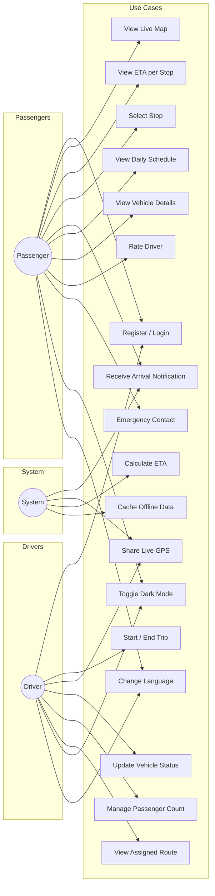

# Batta Tracker — Use Case Diagram

## Actors

| Actor | Description |
|-------|-------------|
| **Passenger** | Travels on Batta Lorry; tracks vehicles and receives ETAs |
| **Driver** | Operates Batta Lorry; shares GPS and manages trips |
| **System** | Automated services (ETA, notifications, caching) |
| **Admin** | Manages routes, vehicles, and schedules (Firebase Console) |

## Use Case Diagram

## Use Case Descriptions

### Passenger Use Cases

| ID | Use Case | Description |
|----|----------|-------------|
| UC1 | Register / Login | Create account or sign in via Firebase Auth |
| UC2 | View Live Map | See Batta Lorry positions on Google Maps |
| UC3 | View ETA per Stop | See estimated arrival time for each route stop |
| UC4 | Select Stop | Choose stop for proximity notifications |
| UC5 | Receive Arrival Notification | Get push notification when vehicle ≤5 min away |
| UC6 | View Daily Schedule | See departure times from Kalpitiya |
| UC7 | View Vehicle Details | See speed, status, and vehicle info |
| UC8 | Rate Driver | Submit 1–5 star rating after trip |
| UC9 | Emergency Contact | Quick-dial police, ambulance, hotline |

### Driver Use Cases

| ID | Use Case | Description |
|----|----------|-------------|
| UC10 | Start / End Trip | Begin or finish a route trip |
| UC11 | Share Live GPS | Broadcast location every 5 seconds |
| UC12 | Update Vehicle Status | Set Available, Full, Delayed, Out of Service |
| UC13 | Manage Passenger Count | Increment/decrement passenger count |
| UC14 | View Assigned Route | See route stops and details |

### System Use Cases

| ID | Use Case | Description |
|----|----------|-------------|
| UC15 | Calculate ETA | Haversine distance + speed-based time estimate |
| UC16 | Cache Offline Data | Store routes/schedules in SharedPreferences |
| UC17 | Toggle Dark Mode | Switch light/dark Material 3 theme |
| UC18 | Change Language | Switch between English, Sinhala, Tamil |
